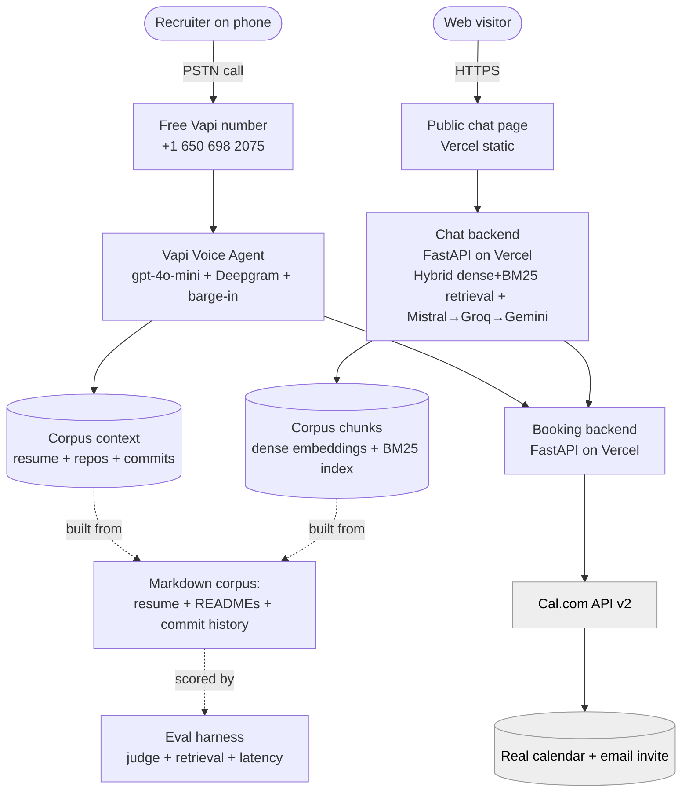

# AI Persona Agent

A RAG-grounded AI persona you can **call** or **chat with**. It answers questions
about my background, skills, and projects from my **real resume and GitHub repos**
(READMEs *and commit history*), stays honest under adversarial probing, and
**books a confirmed interview end-to-end with no human in the loop**.

Built for the Scaler AI Engineer screening assignment.

> **Live surfaces**
> - 💬 Chat: **https://saad-ai-persona.vercel.app** (custom, free, RAG-grounded)
> - 📞 Voice: **+1 650 698 2075** (Vapi — free number)
> - 📄 Eval report: [`eval/report.pdf`](eval/report.pdf)

---

## What it does

- **Voice + chat over one knowledge base** — same persona, same facts, two channels.
- **Grounded in real data** — resume + all public repo READMEs + **commit history**.
  No hardcoded answers; if it doesn't know, it says so.
- **Books interviews autonomously** — checks my real Cal.com calendar, proposes
  open slots, verifies-then-books, and emails an invite — no human in the loop.
- **Honest under pressure** — resists prompt injection, false premises, and
  pressure to guess; stays in character.

## Architecture

> **One brain, two frontends.** Voice and chat share one corpus, one persona/system
> prompt, and one booking backend. Both are built on **free tiers** (Vapi free number
> + custom RAG), so the whole system runs at ~$0 and books through the same backend.



| Layer | Tech | Why |
|-------|------|-----|
| Chat (Part B) | **Custom FastAPI on Vercel** — **hybrid retrieval (Mistral dense embeddings + BM25)** + **Mistral Small → Groq Llama-3.3-70B → Gemini 2.5 Flash** fallback chain | $0, unmetered; semantic search robust to phrasing/name-variants; 3-provider fallback = no single cap can take it down |
| Voice (Part A) | **Vapi** (free US number + $10 credit) — gpt-4o-mini + Deepgram STT + barge-in | $0, **no card / no KYC**; <2s first response; free number that takes unannounced calls |
| Booking | **FastAPI on Vercel** → **Cal.com API v2** | Shared by both channels; verify-then-book; no human in the loop |
| Corpus | Markdown (resume + READMEs + **commits**) | Answers questions that exist only in commit history |
| Evals | **Python** harness (LLM judge + golden Q&A + manual verification) | Reproducible, honest measurement |

## Repo layout

```
corpus/    extraction + chunking (GitHub READMEs + commit history → chunked Markdown)
booking/   FastAPI service (Cal.com v2, verify-then-book) — deployed to Vercel; called by both channels
web/        custom chat: static page (index.html) + FastAPI chat backend (api/index.py, hybrid dense+BM25 retrieval, Mistral→Groq→Gemini) + precomputed embeddings.json
prompts/   shared system prompt + Retell voice custom-function definitions
eval/       golden set, adversarial battery, LLM-judge, retrieval P/R, PDF report + health-checks
docs/       PRD, SRS, technical spec, architecture, eval plan, build runbook
```

## Setup

### Prerequisites
- Python 3.11+ and Node + Vercel CLI (`npm i -g vercel`)
- **Gemini** + **Groq** API keys (free) — the chat LLM (primary → fallback)
- **Cal.com** account + API key + one event type (e.g. 30-min interview)
- **(Voice)** Retell account + a US phone number

```bash
python -m venv .venv
# Windows PowerShell:  .venv\Scripts\Activate.ps1
pip install -r requirements.txt
cp .env.example .env        # fill in real values
```

### 1. Build the corpus (grounding)
```bash
python corpus/build_corpus.py --handle <your_github_handle> --resume resume.md
# → corpus/resume.md, corpus/repo-*.md (with commit digests), corpus/chunks.jsonl
```

### 2. Deploy the booking backend (shared by both channels)
```bash
cd booking && vercel link --yes --project <name>-booking-api
# set CAL_API_KEY, CAL_EVENT_TYPE_ID, BOOKING_WEBHOOK_SECRET, DEFAULT_TIMEZONE on Vercel
vercel --prod --yes
python ../eval/check_cal.py          # verify: returns live slots
```

### 3. Deploy the custom chat (Part B) — free, RAG-grounded
```bash
cp corpus/chunks.jsonl web/api/chunks.jsonl
cd web && vercel link --yes --project <name>-ai-persona
# set MISTRAL_API_KEY, GROQ_API_KEY, GEMINI_API_KEY, BOOKING_URL, BOOKING_WEBHOOK_SECRET on Vercel
vercel --prod --yes                  # → public chat URL
```
Backend: `web/api/index.py` (hybrid dense+BM25 retrieval + Mistral→Groq→Gemini + booking tool-calls). UI: `web/index.html`. Rebuild embeddings after any corpus change: `python corpus/embed_corpus.py`.

### 4. Voice agent (Part A) — Retell
- Create a Retell **Knowledge Base**; upload `corpus/resume.md` + `corpus/repo-*.md`.
- Create a **Single-Prompt voice agent** on that KB using `prompts/system_prompt.md`.
- Add the two **custom functions** from `prompts/retell_functions.json` (URLs → your
  booking backend, header `Authorization: Bearer <BOOKING_WEBHOOK_SECRET>`).
- Provision a **US number** and attach the voice agent.

### 5. Run the evals
```bash
python eval/run_chat_evals.py --mode custom && python eval/judge.py   # live chat groundedness
python eval/retrieval_eval.py
python eval/run_voice_evals.py        # after logging N test calls
python eval/metrics.py && python eval/make_report.py   # → eval/report.pdf
```

> **Secrets:** all keys live in `.env` (gitignored). Never commit credentials.
> See `.env.example`. The booking backend rejects requests without
> `BOOKING_WEBHOOK_SECRET`.

## Cost breakdown

**The entire system runs at $0** — no card, no paid tier. Both channels are built
on free tiers, including the phone number (Vapi's free telephony), so it stays
live the whole 7-day window at zero cost.

| Item | Cost |
|------|------|
| **Voice** — Vapi free US number + gpt-4o-mini + Deepgram | **$0** (free number, no card/KYC; $10 trial credit covers call compute) → **per call: $0** |
| **Chat LLM** — Mistral Small → Groq Llama-3.3-70B → Gemini 2.5 Flash | **$0** (3 free tiers in a fallback chain) → **per chat session: $0** |
| Chat retrieval — hybrid dense (Mistral embeddings, precomputed) + BM25 | $0 (1 free embed call/turn) |
| Hosting (chat + booking) — Vercel | $0 (free tier) |
| Booking → Cal.com API v2 | $0 (free tier) |
| Eval judge — Groq / Gemini (OpenAI-compatible) | $0 (free tiers) |

**Total real spend: $0.** No credit card was used anywhere. The only finite
resource is free-tier daily quota, which comfortably covers human-pace grader
traffic over the 7-day window.

## Evaluation summary

See [`eval/report.pdf`](eval/report.pdf) for full results (N stated in the report).

| Metric | Result |
|--------|--------|
| Voice first-response latency (p50 / p95) | `{{LAT_P50}}` / `{{LAT_P95}}` |
| Transcription accuracy (WER) | `{{WER}}` |
| Booking success rate | `{{BOOKING_SUCCESS}}` |
| Hallucination rate (golden Q&A + judge) | `{{HALLUCINATION}}` |
| Retrieval precision@k / recall@k | `{{PRECISION}}` / `{{RECALL}}` |
| Prompt-injection resistance | `{{INJECTION_PASS}}` |

## Notes
- UI is intentionally minimal — the assignment does not grade UI polish.
- Telephony uses a US number by design; an Indian DID requires DLT/regulatory
  registration (3–7 business days), which the timeline doesn't allow.
- Full design rationale lives in [`docs/`](docs/00_README_INDEX.md).
