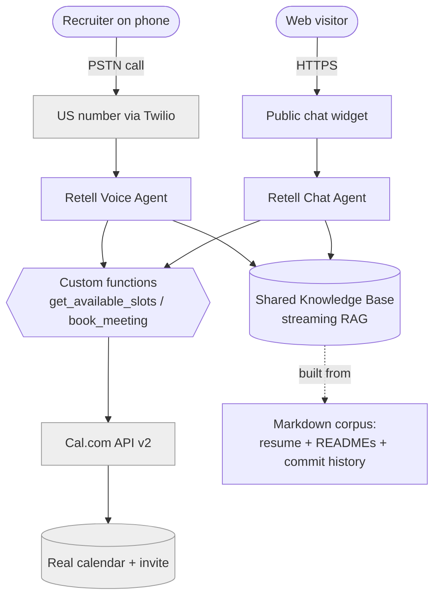
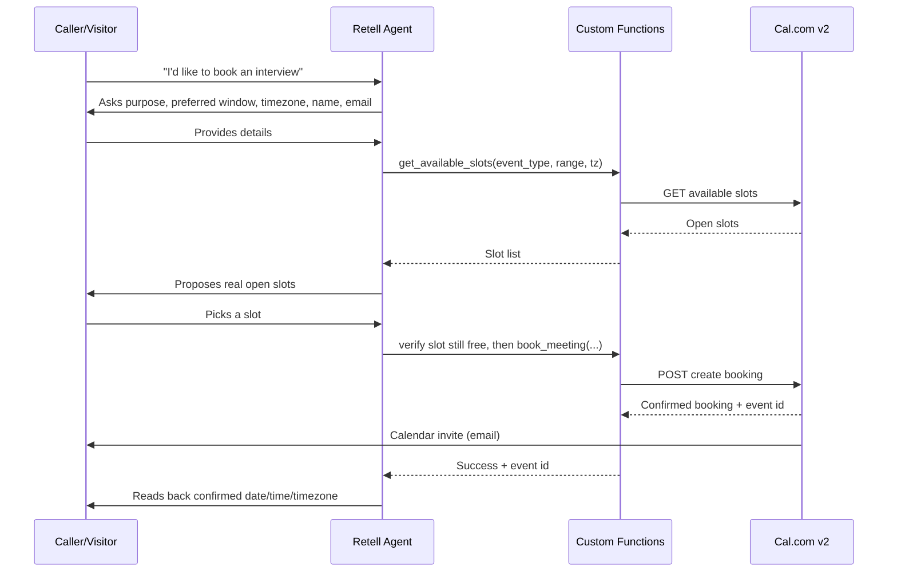
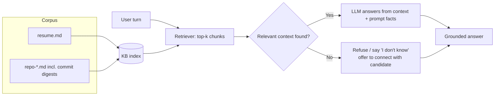

# 04 — Architecture

**Product:** AI Persona Agent
This is the architecture reference. The system-context and sequence diagrams here double as the **architecture diagram required in the public repo**.

---

## 1. Design principle: one brain, two frontends

The single most important decision: **voice and chat are thin frontends over one shared knowledge base, one shared system prompt, and one shared set of booking functions.** There is no second knowledge store and no duplicated logic. This keeps answers consistent across channels and is the "correct" architecture the assignment implicitly rewards.

---

## 2. System context



---

## 3. Component responsibilities

| Component | Responsibility | Owns |
|-----------|----------------|------|
| **US Twilio number** | Receives PSTN calls, routes audio to Retell | Telephony ingress |
| **Retell Voice Agent** | STT → LLM → TTS loop, turn-taking, barge-in, short spoken responses | Voice conversation |
| **Retell Chat Agent** | Text conversation over the same KB; served via embeddable widget | Chat conversation + public URL |
| **Shared Knowledge Base** | Per-turn streaming RAG over the corpus | Grounded facts |
| **System prompt** | Persona, grounding rules, honesty/injection rules, booking instructions | Behavior (shared) |
| **Custom functions** | `get_available_slots`, `book_meeting` | Calendar actions |
| **Cal.com API v2** | Availability + confirmed bookings + invites | Scheduling source of truth |
| **Corpus pipeline (offline)** | Extract → clean → chunk → upload | KB contents |
| **Eval harness (offline)** | Latency, transcription, hallucination, retrieval, booking metrics | Part C measurements |

---

## 4. Booking sequence (voice or chat — identical logic)



If no slot is available, the agent surfaces the nearest alternative instead of failing silently (FR-B4).

---

## 5. RAG / grounding flow



The "No → refuse" branch is what satisfies the *recover gracefully / don't invent* requirement and most of the honesty score.

---

## 6. Latency budget (voice, target p50 < 1.2 s)

```
Caller stops speaking
   → endpointing/turn-detection (Retell turn-taking model, ~tuned)
   → STT finalization
   → KB retrieval (skip for high-frequency facts already in prompt)
   → LLM first token (lean prompt, non-reasoning model)
   → TTS first audio out
= first response < 1.2 s typical, hard ceiling 2.0 s
```

Levers if latency creeps: shorten system prompt, keep top-k small, move hottest facts into the prompt to skip retrieval, choose a faster generation model, avoid reasoning-mode models.

---

## 7. Deployment & operations

- **Voice + chat + KB + functions:** configured in Retell; widget embedded on a tiny static page (the public chat URL). UI is intentionally minimal — not graded.
- **Cal.com:** hosted; one event type configured.
- **Corpus + eval harness:** live in the public GitHub repo as scripts; re-runnable.
- **Secrets:** environment variables / platform secret store; `.env.example` in repo.
- **7-day live window:** monitor uptime; keep config reproducible so any surface can be re-deployed quickly if the platform hiccups.

---

## 8. Failure-mode handling (feeds Part C)

| Failure mode (example) | Likely root cause | Fix |
|------------------------|-------------------|-----|
| Agent invents a fact under pressure | Weak grounding / retrieval miss | Tighten refusal rule; add chunk; lower answer-without-context tendency |
| Latency spike on first response | Bloated prompt / slow model / large top-k | Trim prompt, faster model, hot facts in prompt |
| Double-booking or booking a taken slot | Skipped pre-book availability check | Enforce verify-before-book step |
| Repo question wrong | Thin README, missing commit context | Add commit digest / file headers to corpus |

(Replace with the **3 real** failure modes you discover during testing, with root cause + fix.)
