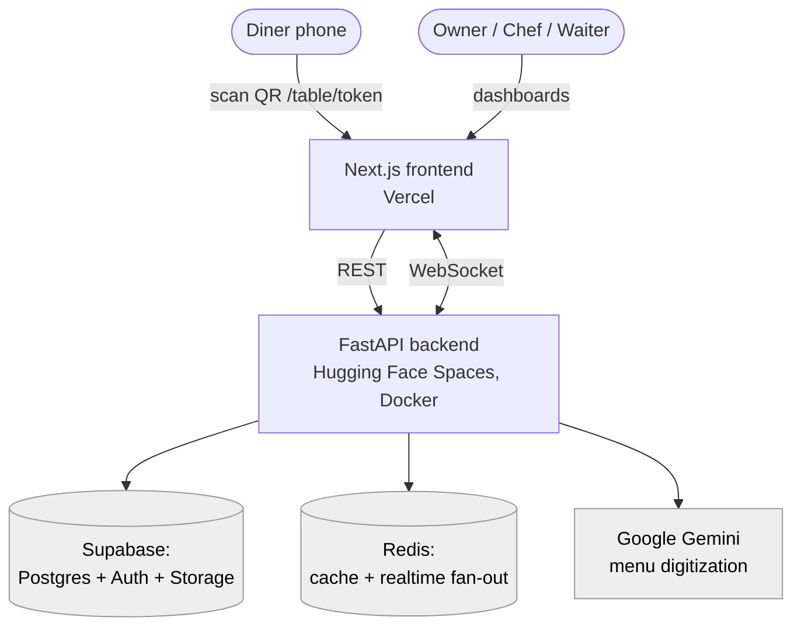

<!--
Generated README for the NoMoosh repo. Copy this file to the ROOT of
https://github.com/saadrizvi09/NoMoosh as README.md, commit it, then re-run
`python corpus/build_corpus.py --handle saadrizvi09 --resume resume.md` so the
persona's knowledge base picks it up. Everything below is grounded in the repo's
actual code, backend/README.md, and commit history — nothing invented.
-->

# 🍽️ NoMoosh

**QR-based restaurant ordering & operations platform** — diners scan a QR code at
their table to browse the menu and order; restaurant owners onboard in minutes
with **AI-powered menu digitization**; and chef, waiter, and owner dashboards
receive **real-time order updates** over WebSockets.

🔗 **Live:** https://no-moosh.vercel.app

---

## What it does

- **Multi-step restaurant onboarding** — owners add restaurant details, cuisine,
  documents, and a menu through a guided flow.
- **AI menu digitization (Google Gemini)** — uploaded menu documents are parsed
  into structured, editable menu items, with a review step before publishing.
- **QR table ordering** — each table has a tokenized link (`/table/[token]`) so
  diners order directly from their phone, no app install.
- **Real-time, role-based dashboards** — separate views for **owner**, **chef**,
  and **waiter**; orders propagate live via WebSockets backed by Redis.
- **Auth & storage** — authentication and file storage via Supabase, with a
  PostgreSQL database.
- **Geocoding / location services** for restaurant setup.

## Architecture



## Tech stack

| Layer | Tech |
|-------|------|
| Frontend | Next.js 15 (App Router, Turbopack), React 19, TypeScript, Tailwind CSS v4, Framer Motion, Supabase JS |
| Backend | Python, FastAPI, WebSockets, Redis, Supabase (Postgres + Auth + Storage) |
| AI | Google Gemini (menu digitization) |
| Infra | Frontend on Vercel · Backend on Hugging Face Spaces (Docker) |

## Repo structure

```
frontend/                 Next.js app (Vercel)
  src/app/
    onboard/              multi-step onboarding: details, cuisine, documents, menu, review
    dashboard/            owner / chef / waiter dashboards
    table/[token]/        QR table-ordering page for diners
    staff/                staff login + signup
  src/lib/                api client, supabase client, onboarding status
backend/                  FastAPI app (Hugging Face Spaces, Docker)
  main.py                 app entry
  routers/                auth, onboarding, menu, orders, tables, staff, geocode, ws
  services/               gemini_service (menu digitization), storage_service
  ws_manager.py           WebSocket connection manager
  redis_client.py         Redis client (cache + realtime)
  supabase_client.py      Supabase client
  schema.sql / schema_v2.sql   Postgres schema
```

## Getting started

### Backend (FastAPI)
```bash
cd backend
pip install -r requirements.txt
cp .env.example .env        # fill in the values below
uvicorn main:app --reload
```
Required environment variables:
```bash
SUPABASE_URL=your_supabase_project_url
SUPABASE_SERVICE_KEY=your_supabase_service_role_key
SUPABASE_ANON_KEY=your_supabase_anon_key
GEMINI_API_KEY=your_google_gemini_api_key
FRONTEND_URL=your_frontend_url
```
API docs once running: `/docs` (Swagger), `/redoc`, `/health`.

### Frontend (Next.js)
```bash
cd frontend
npm install
npm run dev        # http://localhost:3000
```

## Deployment
- **Frontend → Vercel** (`frontend/`).
- **Backend → Hugging Face Spaces** via Docker SDK (`backend/Dockerfile`,
  `deploy_to_hf.bat`).

## Engineering notes
The real-time layer was the main engineering focus: orders fan out to the
owner/chef/waiter dashboards over WebSockets, with **Redis** added for caching
and cross-worker message delivery, and several rounds of **WebSocket and latency
optimization** to keep dashboard updates snappy under load.

## License
MIT
